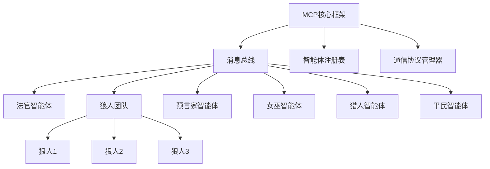

使用MCP(Multi-Agent Communication Protocol)框架实现狼人杀游戏是个不错的选择，MCP能很好地处理多智能体间的通信和协作问题。以下是基于MCP框架的狼人杀系统设计与实现：


### **一、MCP框架架构设计**
#### **1. 系统组件**


#### **2. 消息协议设计**
```python
# 消息格式定义
class Message:
    def __init__(self, sender, receiver, content, msg_type, timestamp=None):
        self.sender = sender          # 发送者ID
        self.receiver = receiver      # 接收者ID（可为广播"all"或组"werewolves"）
        self.content = content        # 消息内容
        self.msg_type = msg_type      # 消息类型：vote, speak, skill, result等
        self.timestamp = timestamp or time.time()
        
    def to_dict(self):
        return vars(self)

# 游戏状态消息
class GameState:
    def __init__(self, phase, alive_players, history=None):
        self.phase = phase            # 阶段：night/day
        self.alive_players = alive_players  # 存活玩家列表
        self.history = history or []  # 历史记录
```


### **二、智能体实现**
#### **1. 基础智能体类**
```python
from mcp_framework import Agent, Message

class WolfKillAgent(Agent):
    def __init__(self, agent_id, role):
        super().__init__(agent_id)
        self.role = role              # 角色类型
        self.private_info = {}        # 私有信息
        self.game_state = None        # 游戏状态
        self.available_actions = []   # 可用行动列表
    
    def on_message(self, message):
        """处理接收到的消息"""
        if message.msg_type == "game_state":
            self.game_state = message.content
            self._update_available_actions()
        elif message.msg_type == "private_info":
            self.private_info.update(message.content)
        
        # 根据消息类型生成响应
        response = self._generate_response(message)
        if response:
            self.send(response)
    
    def _update_available_actions(self):
        """根据当前游戏状态更新可用行动"""
        if self.game_state.phase == "night":
            if self.role == "werewolf":
                self.available_actions = ["kill"]
            elif self.role == "seer":
                self.available_actions = ["inspect"]
            # 其他角色行动...
            
    def _generate_response(self, message):
        """生成智能体响应"""
        if message.msg_type == "request_action":
            action = self._decide_action()
            return Message(
                sender=self.agent_id,
                receiver="judge",
                content=action,
                msg_type="action"
            )
        return None
    
    def _decide_action(self):
        """根据私有信息和游戏状态决定行动"""
        # 由具体角色实现
        pass
```

#### **2. 法官智能体**
```python
class JudgeAgent(Agent):
    def __init__(self):
        super().__init__("judge")
        self.game_state = None
        self.players = {}            # 玩家注册表
        self.werewolves = []         # 狼人列表
        self.phase = "init"          # 游戏阶段
    
    def setup_game(self, player_agents):
        """初始化游戏，分配角色"""
        # 角色分配逻辑...
        roles = ["werewolf"] * 3 + ["seer", "witch", "hunter", "villager"] * 2
        random.shuffle(roles)
        
        for i, agent in enumerate(player_agents):
            role = roles[i]
            self.players[agent.agent_id] = role
            if role == "werewolf":
                self.werewolves.append(agent.agent_id)
            
            # 发送私有信息
            private_msg = Message(
                sender="judge",
                receiver=agent.agent_id,
                content={"role": role},
                msg_type="private_info"
            )
            self.send(private_msg)
        
        # 初始化游戏状态
        self.game_state = GameState(
            phase="night",
            alive_players=list(self.players.keys())
        )
        self._broadcast_game_state()
    
    def _broadcast_game_state(self):
        """广播当前游戏状态"""
        state_msg = Message(
            sender="judge",
            receiver="all",
            content=self.game_state,
            msg_type="game_state"
        )
        self.send(state_msg)
    
    def on_message(self, message):
        """处理玩家行动消息"""
        if message.msg_type == "action":
            # 处理玩家行动...
            if self.phase == "night":
                self._process_night_action(message)
            else:
                self._process_day_action(message)
            
            # 检查游戏是否结束...
            if self._check_game_over():
                self._end_game()
            else:
                self._advance_phase()
```

#### **3. 狼人智能体**
```python
class WerewolfAgent(WolfKillAgent):
    def __init__(self, agent_id):
        super().__init__(agent_id, "werewolf")
        self.wolf_chat_history = []  # 狼人团队聊天历史
    
    def _decide_action(self):
        """狼人决策逻辑"""
        if "kill" in self.available_actions:
            # 选择击杀目标
            target = self._select_kill_target()
            return {"action": "kill", "target": target}
        elif "chat" in self.available_actions:
            # 狼人团队聊天
            message = self._generate_wolf_chat()
            return {"action": "chat", "message": message}
        return None
    
    def _select_kill_target(self):
        """选择击杀目标的逻辑"""
        # 分析游戏状态，选择高威胁目标
        # 例如：优先击杀预言家、女巫等神职
        for player_id in self.game_state.alive_players:
            if self._is_high_value_target(player_id):
                return player_id
        
        # 随机选择一个目标
        return random.choice(self.game_state.alive_players)
```


### **三、MCP通信协议**
#### **1. 夜间阶段通信流程**
```python
# 法官广播夜间开始
judge.send(Message(
    sender="judge",
    receiver="all",
    content={"phase": "night", "message": "夜晚降临，请闭眼"},
    msg_type="phase_change"
))

# 法官通知狼人睁眼
judge.send(Message(
    sender="judge",
    receiver="werewolves",
    content={"message": "狼人请睁眼，选择击杀目标"},
    msg_type="private_info"
))

# 狼人团队内部通信
wolf1.send(Message(
    sender=wolf1.agent_id,
    receiver="werewolves",
    content={"message": "我建议杀3号，他像预言家"},
    msg_type="wolf_chat"
))

# 收集狼人击杀决策
kill_votes = judge._collect_wolf_votes()
judge.game_state.last_kill = max(kill_votes, key=kill_votes.get)
```

#### **2. 白天阶段通信流程**
```python
# 法官广播白天开始
judge.send(Message(
    sender="judge",
    receiver="all",
    content={
        "phase": "day",
        "message": "天亮了，昨晚死亡的是：" + str(judge.game_state.last_kill)
    },
    msg_type="phase_change"
))

# 按顺序收集玩家发言
for player_id in judge._get_speaking_order():
    judge.send(Message(
        sender="judge",
        receiver=player_id,
        content={"message": "请发言"},
        msg_type="request_speak"
    ))
    
    # 等待玩家回复
    response = judge._wait_for_response(player_id)
    judge.game_state.history.append({
        "player": player_id,
        "type": "speak",
        "content": response.content
    })

# 发起投票
judge.send(Message(
    sender="judge",
    receiver="all",
    content={"message": "开始投票，请选择放逐目标"},
    msg_type="vote_start"
))
```


### **四、游戏流程控制**
#### **1. 回合管理器**
```python
class RoundManager:
    def __init__(self, judge):
        self.judge = judge
        self.current_round = 1
        self.phase_order = ["night", "day"]
        self.current_phase_index = 0
    
    def next_round(self):
        """进入下一回合"""
        self.current_round += 1
        self.current_phase_index = 0
        self._start_phase()
    
    def next_phase(self):
        """进入下一阶段"""
        self.current_phase_index = (self.current_phase_index + 1) % len(self.phase_order)
        if self.current_phase_index == 0:  # 完成一个完整回合
            self.next_round()
        else:
            self._start_phase()
    
    def _start_phase(self):
        """开始当前阶段"""
        phase = self.phase_order[self.current_phase_index]
        self.judge.phase = phase
        
        if phase == "night":
            self.judge._start_night_phase()
        else:
            self.judge._start_day_phase()
```

#### **2. 胜利条件检查**
```python
def _check_game_over(self):
    """检查游戏是否结束"""
    alive_roles = [self.players[p] for p in self.game_state.alive_players]
    
    # 狼人胜利条件：平民或神民全部死亡
    if not any(r in alive_roles for r in ["villager", "seer", "witch", "hunter"]):
        return True, "werewolves"
    if not any(r == "werewolf" for r in alive_roles):
        return True, "villagers"
    
    return False, None
```


### **五、部署与运行**
#### **1. 启动MCP框架**
```python
from mcp_framework import MCPSystem

# 创建MCP系统
mcp_system = MCPSystem()

# 创建并注册智能体
judge = JudgeAgent()
mcp_system.register_agent(judge)

# 创建玩家智能体
players = [
    WerewolfAgent("wolf1"),
    WerewolfAgent("wolf2"),
    WerewolfAgent("wolf3"),
    SeerAgent("seer"),
    WitchAgent("witch"),
    HunterAgent("hunter"),
    VillagerAgent("villager1"),
    VillagerAgent("villager2")
]

for player in players:
    mcp_system.register_agent(player)

# 启动游戏
judge.setup_game(players)
mcp_system.start()
```

#### **2. 交互界面（示例）**
```python
# 简单的命令行界面
def cli_interface():
    while True:
        command = input("输入命令 (status/history/exit): ")
        if command == "status":
            print("当前游戏状态:", judge.game_state.phase)
            print("存活玩家:", judge.game_state.alive_players)
        elif command == "history":
            for event in judge.game_state.history:
                print(f"{event['player']}: {event['content']}")
        elif command == "exit":
            break
```


### **六、关键技术要点**
1. **信息隔离**：通过MCP框架的消息路由机制，确保私有信息仅发送给特定角色  
2. **多智能体协作**：狼人团队通过组播消息实现协作，法官通过广播同步公共信息  
3. **状态管理**：法官维护全局游戏状态，并定期广播更新  
4. **异步通信**：使用非阻塞消息处理，避免智能体间的执行依赖  

这种架构设计可以灵活扩展角色和规则，适合实现各种狼人杀变体。如果需要更复杂的AI决策逻辑，可以结合强化学习训练每个角色智能体，使其行为更接近人类玩家。